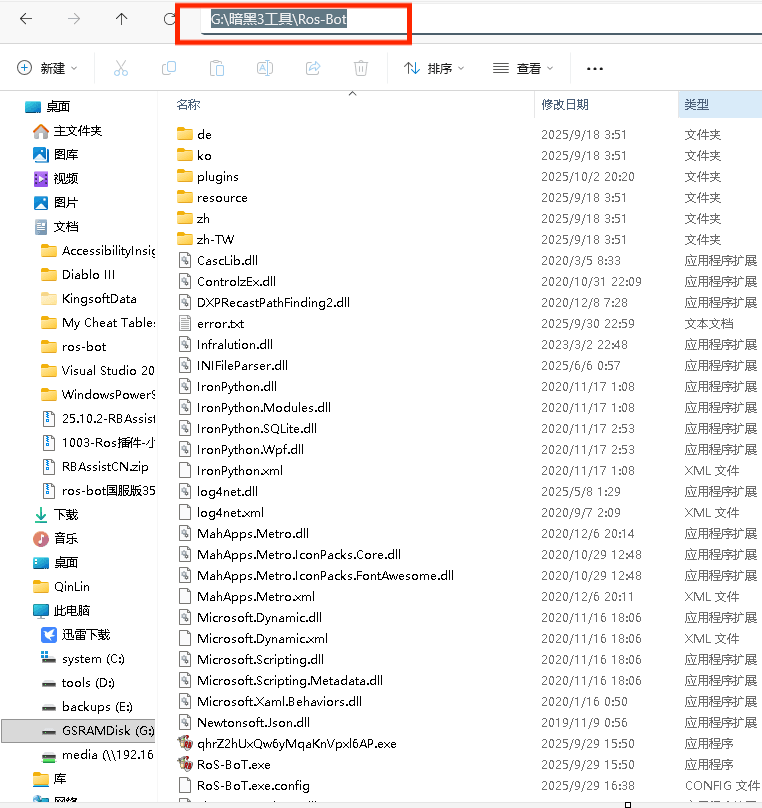
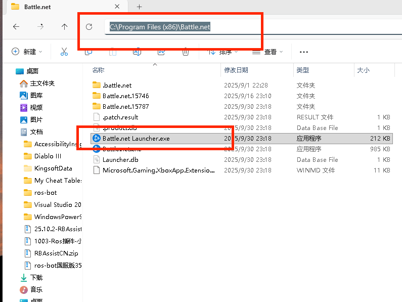

# 常见问题：

## 路径不会设置，一共就需要设置4个路径，我用图片给你展示。

4.7以上版本，logs.txt和history.txt已经默认配置为系统路径，不用调整，只需要修改
ros-bot的路径和战网启动器路径就可以，这两个现在已经支持自动搜索，如果没自己改名，理论都可以搜索出来

# 需要设置的路径有：

1. ros-bot的路径，需要设置为ros-bot的根目录，例如：C:\ros-bot
如图所示

2. 中控战网启动器的文件路径，需要设置为中控战网启动器的文件路径，例如：C:\中控战网\start.bat

# 程序运行遇到无法注入，无法启动bridge这类的，请先检查是否使用管理员身份运行。

# 如果还有问题，请仔细看上面两个你做对了吗？
