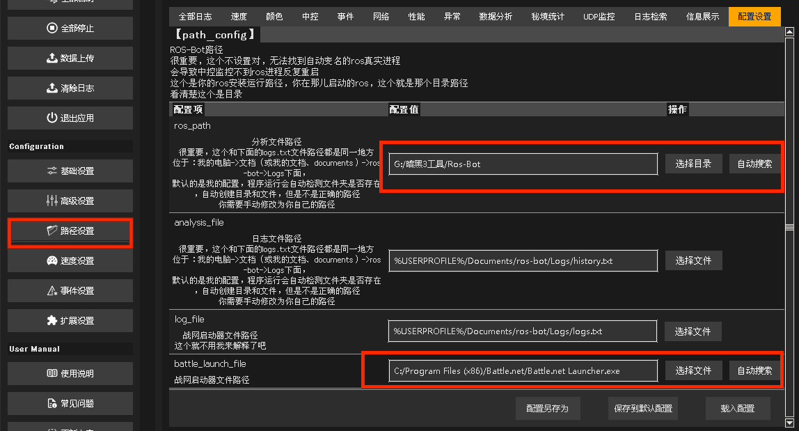
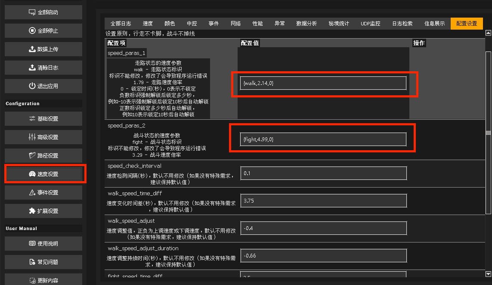
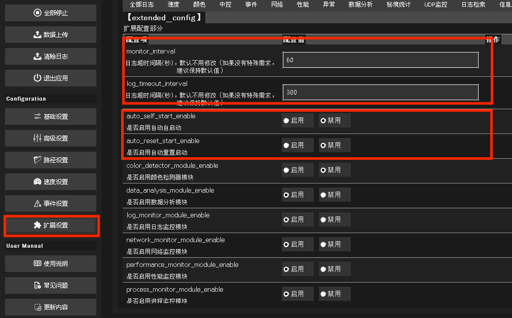
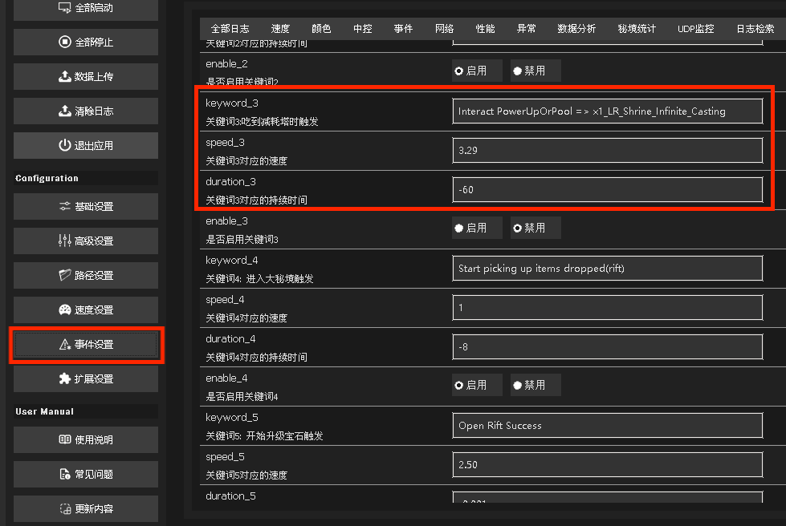
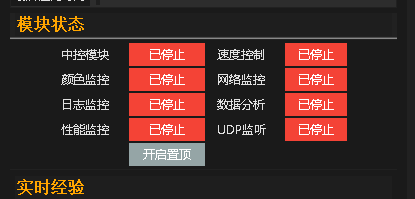
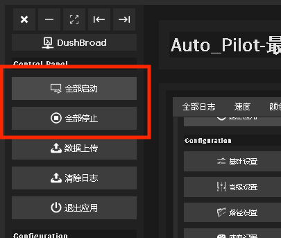

# 程序使用说明

## 一、注意事项
> 程序运行前，请务必仔细阅读以下说明。
**重要提醒**：先不要直接运行程序，先不要直接运行程序，先不要直接运行程序，重要的事情说三遍！！！

自动变速使用原则 : 
**行走不卡脚,战斗不掉线**
善用锁定变速,实现特殊场景提速,如:杀王,点宝石,回城,分解,存东西等,很多场景可以自己设想,程序基本都能满足。

## 二、程序使用说明
开始使用前，请先**完成路径配置**。

### 1. 路径配置（必做）⚠️ 此配置不成功会导致程序运行失败。

1. 打开**路径设置**。
2. 找到 ros_path 配置项，修改为你的 ros-bot 运行目录。  注意，这里是【选择目录，不是选择文件】。
3. 找到 battle_launch_file 配置项，修改为你的 战网启动器。  注意，这里是【选择文件，不是选择目录】。  
   

### 2.（可选）速度设置，根据你的配置和网速调整速度。

### 3. （可选）中控配置，这里可以配置中控的参数。

1、中控版和睡大的中控2个用一个就行了，不然可能会有冲突，不知道谁在启动。
2、第一个参数配置中控监控的时间间隔，第二个参数是设置日志超时，默认5分钟（300秒），如果中控日志超过5分钟没有更新，程序会认为ros已离线。

### 4. 事件配置（可选），这里可以修改各种事件的触发条件。

其他配置项可参考注释说明，根据个人需求自行修改。

### 5. 其他配置（可选）。

例如基础设置，高级设置，没有特别需求，或者精通电脑编程相关的，不要去随意修改，里面都是包含系统运行的一些基础参数，自行修改可能导致效率低下。

### 6. 模块启停。
通过右边模块状态，可以单独启动或停止某个模块。

也可以通过这里，全部启动和全部停止。
