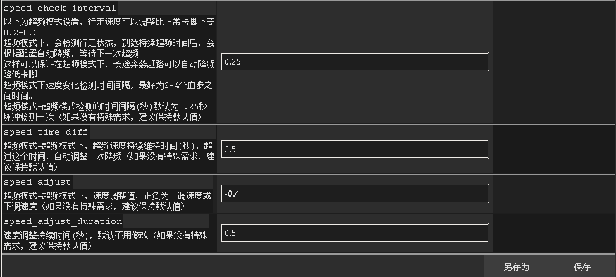

# V4.8.1 5g优化版使用说明：

## 本包仅仅适合下载使用过4.8.0.5G版更新主程序，没使用过4.8.0版本先下载4.8.0的zip完整包，解压再把本压缩包内容拷贝进去更新

### 5G过载版属于风险和收益并存的玩法

你战斗倍数越高，失败的风险越大，但是如果失败少，你的经验就越高，根据自己需求和风险承受能力选择；

我对ap做了如下7个配置，各种配置风险不同：

1、可以认为没失败风险，战斗恒定2.99倍加速，经过测试12小时无失败

行走过载2.14战斗不过载2.99.ini

2、超低失败风险，战斗3.29，战斗3.49，高灵敏过载0.5-1秒，经过测试8-10小时无失败，偶尔1-2次

行走过载2.14战斗过载0.5秒3.29.ini
行走过载2.14战斗过载1秒3.49.ini

3、低失败风险，战斗3.49 战斗3.79 中高灵明过载1.5-2秒，经过测试8-10小时失败可能1-4次

行走过载2.14战斗过载1.5秒3.79.ini
行走过载2.14战斗过载2秒3.99.ini

4、中失败风险。战斗4.49 过载3秒，经过测试8小时失败可能1-7次
行走过载2.14战斗过载3秒4.49.ini

5、高失败风险，战斗4.99 过载3.5秒 经过测试可能1小时1-2次，也可能不失败
行走过载2.14战斗过载3秒4.49.ini

是否失败很多因素决定，主要还是超频战斗时间，如果过长容易被服务器检测，导致踢下线，如果你输出够快，输出够高，配置高，装备好，延迟低，可以尝试高加速，收益更高，如果对自己没自信，可以选择低风险方案

如何选择，看自己风险承受能力和自己本身的情况了

使用4.8.1版本，载入配置，重新修改路径，保存配置到默认即可使用。

# V4.8.0 5G版使用说明：

1、行走过载和战斗过载分开设置，可以提供战斗5倍加速；
2、提供新插件，游戏状态获取，从ros插件获取战斗、行走状态，巅峰等级，秘境层数，角色类型，身上钥匙，血岩数量等，后期会提供保存物品，物品属性等更多信息；
3、战斗5倍需谨慎使用，如果设置不好，很容易掉线失败，如果不想使用战斗5倍，修改战斗状态下为正常3倍，最后速度设置最后三项全改为0；
4、战斗5倍或5倍以上，需根据个人电脑配置，网络延迟微调，才能保持最佳状态，不掉线，推荐使用强者，据说使用强者更不容易掉线。
5、5G版本默认开启udp监控模块，从插件获取战斗行走状态，默认关闭颜色监控，但是保留颜色监控功能，如果没有安装插件，可以手动开启颜色监控，实现行走战斗变速；
6、5G版本 UDP监控和颜色监控，2个模块最好只开启一个，使用插件的开启udp监控，不使用插件的开启颜色监控，两个一起开容易打架；
7、使用5倍战斗加速，如果发生掉线失败，后果自负；
8、安装插件，并启用后，可以关闭F4,不显示日志；
9、拷贝插件plugins目录，放到rosbot运行目录下，并在ros里设置启用插件；
10、推荐用5G版专用主档案；

# V4.7.6 超频版使用说明：

## 使用超频版，保守估计可以提升基础行走加速0.2-0.3倍，具体效果取决于服务器检测速度和自身延迟。

原理：

    开启加速以后，如果加速不是很离谱，暗黑服务器不会马上检测到并立刻给出回应，
    反应出来就是不会马上就卡脚，一般会等待一段时间后，才会卡脚。我们可以利用
    这个时间差，让行走加速瞬时提高，加快移速。
    因此，我们调高行走的加速度0.2-0.3，设置好超频设置，ap就可以在检测到行走状
    态后，立刻将速度提升至设定的超频值，然后检测超频持续时间（例如3.5秒），超过
    临界时间，自动触发速度调整，在超频基础上下调速度，避免卡脚。

    具体设置在速度设置里，如下图所示：

具体参数说明：
speed_check_interval = 0.25 
; 超频检测间隔时间(秒)，这个时间间隔检测一次是否处于超频状态，超过设定的临界时间，自动调速

speed_time_diff = 3.5
; 超频持续时间(秒)，当角色状态为行走中，且维持时间超过此值，自动调速，这样可以避免长时间奔袭卡脚问题。

speed_adjust = -0.4
; 超频自动调节速度值，正负为上调速度或下调速度，如果设定行走中加速度为2.1，那么调整后速度为2.1-0.4=1.7

speed_adjust_duration = 0
; 超频自动调节持续时间(秒)，维持超频后自动调节速度时间，默认0，不锁定，如果自动调速后还卡脚，可以设置-0.5,-1试试，维持低速1秒，防止卡脚。

### V4.1.0A 更新
全新界面，全面重构，解决卡顿；
新增登陆注册，登陆注册用户可以自动上传实时经验，实时状态，可以通过网站查看实时状态数据，后期还支持网站远程控制，实时同步巅峰，同步物品掉落；

### V3.0.9C 更新
双倍快乐，小米玩家福音！
如图示例：

1、配置管理，导入2倍Ros加速2.5倍游戏加速水人小米配置.ini
2、配置管理修改2个地址：ros地址：  ros日志文件地址：
3、速度我设置小米开门锁2.5倍 50秒，可以自行调节，配置管理的【log_monitor】节点下 keyword_5 =Open Rift Success 相关配置，其他杀王，回城，拾取等变速都有锁定，可以自行调节；
4、ros里，大小米设置里，2倍ros加速等球设置1400，水人疾风击间隔时间10,距离12,这个自己调；
5、rosbot加速在配置管理【basic】节点最后2项，rosbot_speed_enable 和rosbot_speed,rosbot_speed_enable=true 为开启rosbot加速，false为关闭rosbot加速，rosbot_speed速度不能小于1，小于1默认为1，建议不超过3，超过3，rosbot容易崩溃；
6、小米行走和战斗速度在【speed_config】里设置，不过小米开门锁50秒，这个基本不生效，可以不用管；
实测，2倍加速下，rosbot显示的1分钟，实际只有22-23秒，双倍快乐后，pn统计不准，只能从开始时间，和结束时间看钥匙数量了，反正我是很快乐。

### V3.0.0 更新
- 完全重构程序结构，稳定性大幅提升；
- 增加屏幕显示比例适配功能，无需手动调整系统DPI；
- 优化配置管理模块，为所有配置项添加详细注释；
- 采用模块化管理所有功能，降低出错概率；
- 增加警告和错误日志集中输出，便于问题定位；
- 修复大量已知BUG。

### V2.9.6 更新
- 加速锁定时间支持浮点数配置（例如0.01秒），更利于个性化定制日志匹配加速策略。

### V2.9.5 更新
- 配置管理增加路径快捷修改、速度快速修改功能；
- 修复因异常导致程序退出的BUG。

### V2.9.4 更新
- 实现日志分类路由功能，日志展示更清晰明了；
- 修复因日志临时文件删除导致程序异常退出的问题。

### V2.9.3 更新
- 修复日志输出过快导致程序异常退出的问题。

### V2.9.2 更新
- 修复若干小BUG；
- 增加网络延迟实时监控功能；
- 添加程序自动重启功能。

### V29 更新
- 新增图形化界面，操作更简单；
- 摒弃OCR方式获取密度，改用“识别中心区域颜色”判断行走和战斗状态，速度更快、配置更简单；
- 无需手动寻找扫描区域，程序自动识别目标区域。

### V26 更新
- 新增图形化界面，操作更简单；
- 集成配置文件编辑功能，编辑保存后30秒内热加载生效；
- 新增日志分析功能，可查看V26版本生成日志中的行走和战斗时间比（需使用V26生成的日志才准确）；
- 修复若干小BUG。

### V24 更新
- 重构状态识别代码，行走/战斗状态切换超级流畅；
- 优化识别扫描逻辑，监控响应更快更及时；
- 重构config.ini配置文件，结构更简洁高效（需重新配置）。

### V23 更新
- 重构代码，仅保留“动态密度检测变速”功能，响应速度极大优化，行走/战斗切换更流畅；
- 增强游戏注入管理机制，降低掉线率。

