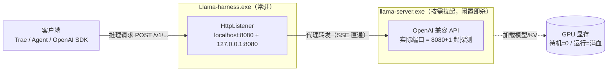
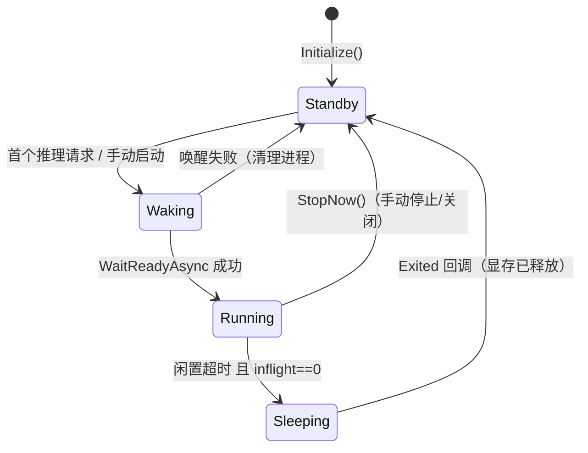
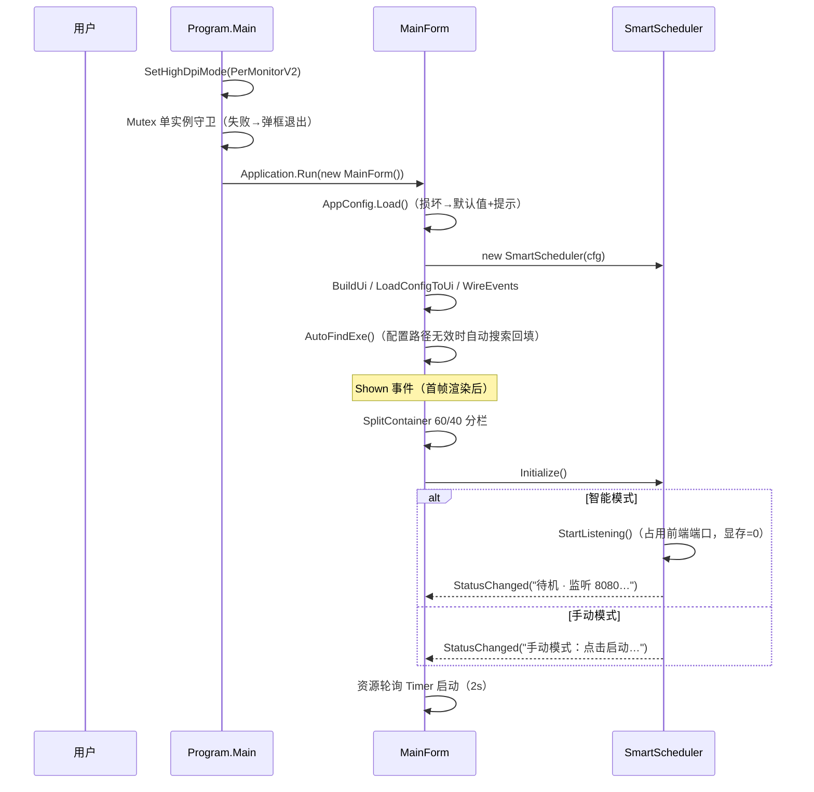
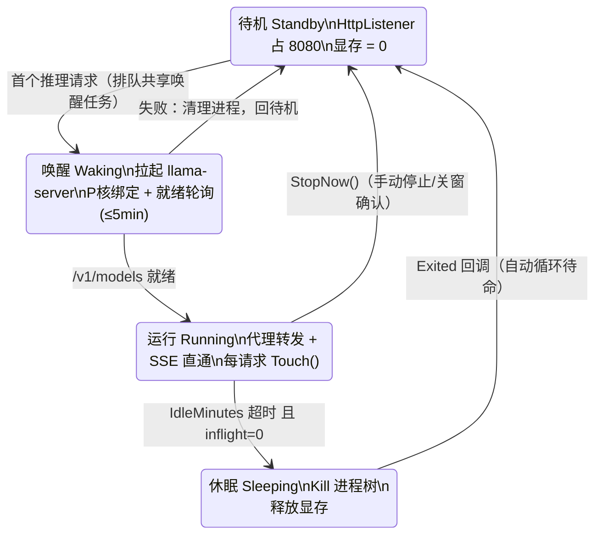

# LlamaHarness 架构设计说明书

| 项目     | 内容                                                       |
| -------- | ---------------------------------------------------------- |
| 文档版本 | v1.0                                                       |
| 编写日期 | 2026-08-27                                                 |
| 代码基线 | git f06bea7（彩色日志分级 + 自动轮切 + 警告错误独立输出）  |
| 适用范围 | LlamaHarness 单项目全部源码（11 个 .cs 文件，约 2100 行） |

---

## 1. 项目概述

### 1.1 定位

LlamaHarness 是一个 Windows 桌面应用，为本地 llama.cpp 的 llama-server（OpenAI 兼容 LLM API 服务）提供：

1. **图形化启动器**：选模型、调参数、一键启停，实时日志；
2. **智能按需调度器**：常驻监听前端端口（默认 8080），首个推理请求触发唤醒，闲置 15 分钟自动休眠释放显存——"用即满血、闲即释放"；
3. **P 核亲和性管理**：Intel 混合架构 CPU（i5-13900F）上把 llama-server 绑定纯 P 核并自愈重绑；
4. **实时推理统计**：解析进程日志 print_timing 块，按请求展示输入/输出速度、投机解码命中率、f_sim_best、总耗时。

### 1.2 技术选型

| 维度   | 选择                                 | 理由                                   |
| ------ | ------------------------------------ | -------------------------------------- |
| 运行时 | .NET 8（net8.0-windows）             | 目标框架，Windows 桌面                 |
| UI     | WinForms                             | 功能边界小，避免 WPF/AvalonUI 过度设计 |
| 依赖   | **零第三方 NuGet 包**                | 单项目自包含，降低供应链与维护成本     |
| HTTP   | System.Net.HttpListener + HttpClient | BCL 内置，监听本机回环无需管理员权限   |
| 配置   | System.Text.Json                     | BCL 内置                               |

### 1.3 部署形态

- 单 exe（Llama-harness.exe），同目录运行时生成：
  - config.json —— 用户配置（含本机模型/exe 路径，不入库）；
  - harness.log / harness.log.1 —— 主日志（2MB 轮切）；
  - warn_error.log —— 警告/错误独立日志（5MB 轮切，带上下文）；
  - unhandled.log —— 崩溃兜底日志。
- 目标硬件环境：Intel i5-13900F（8 P 核 + E 核混合架构）、NVIDIA GPU、本地 27B GGUF 模型（Qwen3.8-27B-Ridge）。

---

## 2. 系统总体架构

### 2.1 分层视图

```mermaid
flowchart TB
    subgraph UI层["UI 层（UI 线程 / STA）"]
        MF[MainForm<br/>参数区 · 操作区 · 资源行 · 日志区 · 统计区]
    end

    subgraph 调度层["调度层（多线程）"]
        SS[SmartScheduler<br/>阶段状态机 · HttpListener 代理<br/>唤醒排队 · 闲置休眠 · 亲和性自愈]
    end

    subgraph 进程层["进程层"]
        LSP[LlamaServerProcess<br/>llama-server 子进程封装<br/>静默运行 · 输出事件 · Kill 进程树]
    end

    subgraph 解析层["解析层（纯逻辑）"]
        PARSER[LlamaStatsParser<br/>print_timing 正则解析<br/>按 task ID 归组 · 50 轮环形淘汰]
    end

    subgraph 支撑层["支撑组件（纯逻辑 / 静态）"]
        CFG[AppConfig<br/>config.json 原子读写 + 黄金底参兜底]
        FINDER[LlamaFinder<br/>exe 三级定位 + 命令行拼接]
        AFF[CpuAffinity<br/>P 核掩码解析/绑定/自愈]
        LOGF[LogFile<br/>日志轮切 + 分级独立输出]
        MET[SystemMetrics<br/>CPU/内存/显存采样]
    end

    MF -->|LaunchNowAsync / StopNow / SetAutoMode| SS
    MF -.->|Log 事件 → BeginInvoke| MF
    SS -->|Start/Stop| LSP
    SS -->|Find / BuildArgs| FINDER
    SS -->|Apply / Heal| AFF
    SS -->|Load / Save| CFG
    SS -->|Log 事件| LOGF
    LSP -->|OutputLine 逐行| SS
    SS -->|Feed(line)| PARSER
    PARSER -->|RoundUpdated 等事件| MF
    MF -->|2s 轮询| MET
```

### 2.2 运行时进程与端口视图



**核心约束**：前端端口（8080）永远由启动器监听；llama-server 从不直接占用 8080，而是使用"前端端口 + 1"起的空闲后端端口。客户端对接地址恒定不变，唤醒/休眠对用户透明。

### 2.3 模块清单

| 文件                  | 行数 | 职责                                                   | 线程归属                                     |
| --------------------- | ---- | ------------------------------------------------------ | -------------------------------------------- |
| Program.cs            | 57   | 入口：高 DPI、单实例 Mutex、全局异常兜底               | UI 主线程                                    |
| MainForm.cs           | 688  | 全部 UI：参数区/操作区/资源行/日志区/统计区；UI 状态机 | UI 线程（事件经 BeginInvoke 编组）           |
| SmartScheduler.cs     | 614  | 智能调度核心：监听代理、唤醒、休眠、自愈               | 多线程（accept loop / timer / 进程回调）     |
| LlamaServerProcess.cs | 90   | llama-server 子进程封装                                | 输出事件来自进程 IO 线程                     |
| LlamaStatsParser.cs   | 169  | print_timing 实时解析（纯逻辑）                        | Feed=进程输出线程，Reset=UI 线程，内部锁串行 |
| AppConfig.cs          | 79   | 配置模型 + config.json 原子持久化                      | 任意线程                                     |
| CpuAffinity.cs        | 66   | P 核掩码解析/绑定/自愈（纯逻辑）                       | 调用方线程                                   |
| LlamaFinder.cs        | 89   | exe 定位 + 命令行拼接（纯逻辑）                        | 调用方线程                                   |
| LogFile.cs            | 100  | 日志文件轮切 + 警告错误独立输出（静态，尽力而为）      | 任意线程（内部锁）                           |
| SystemMetrics.cs      | 134  | CPU/内存/显存只读采样                                  | 后台 Task（2s 轮询）                         |

---

## 3. 核心模块设计

### 3.1 Program —— 入口与兜底

启动顺序：

1. Application.SetHighDpiMode(PerMonitorV2)（必须在创建任何窗口之前）；
2. **单实例守卫**：命名 Mutex "Local\LlamaHarness"，已存在则弹框退出——防止两个实例同时唤醒 llama-server 导致显存双倍占用；
3. EnableVisualStyles + SetUnhandledExceptionMode(CatchException)（UI 线程异常捕获并提示）；
4. AppDomain.UnhandledException 处理器（后台线程异常写 unhandled.log）；
5. Application.Run(new MainForm())，外层 try/catch 兜底。

### 3.2 MainForm —— UI 与状态机

**布局**（Dock 顺序：先 Fill 后 Top，Top 自下而上堆叠）：

```text
┌──────────────────────────────────────────────┐
│ 参数区 paramPanel (TableLayoutPanel, Top)      │
│   exe / 模型 / 端口 / ctx / ngl / parallel /   │
│   no-kv-unified / threads / 附加参数 /         │
│   闲置分钟 / P核掩码 / 强制流式 / 模式开关       │
├──────────────────────────────────────────────┤
│ 操作区 opPanel (Top): 状态标签 | 清空日志 |     │
│   保存配置到… | 载入配置 | 停止 | 启动/唤醒      │
├──────────────────────────────────────────────┤
│ 资源行 _lblRes (Top, 24px): CPU | 内存 | 显存   │
├──────────────────────────────────────────────┤
│ SplitContainer (Fill, 水平分栏, 可拖拽)        │
│ ┌──────────────────────────────────────────┐  │
│ │ 日志区 _txtLog (60%)：只读 TextBox，着色   │  │
│ ├──────────────────────────────────────────┤  │
│ │ 统计区 (40%)：汇总标签 + 清空统计 +         │  │
│ │   DataGridView（8 列）                    │  │
│ └──────────────────────────────────────────┘  │
└──────────────────────────────────────────────┘
```

**UI 状态机**（由调度器 PhaseChanged 事件驱动，ApplyPhase）：

| 阶段                   | 启动按钮 | 停止按钮 | 参数控件                     | 状态颜色 |
| ---------------------- | -------- | -------- | ---------------------------- | -------- |
| Standby（空闲）        | 可用     | 禁用     | 可编辑                       | 灰       |
| Waking（唤醒中）       | 禁用     | 可用     | **全部禁用**（防运行中改参） | 深橙     |
| Running（运行中）      | 禁用     | 可用     | 全部禁用                     | 绿       |
| Sleeping（休眠释放中） | 禁用     | 可用     | 全部禁用                     | 红       |

附加规则：智能模式下端口控件恒禁用（监听器占用端口，改端口需重绑）；运行中导入/导出配置按钮同样禁用。

**关键 UI 机制**：

- **日志区**：AppendLog 可来自任意线程——先写 LogFile.Append（文件），再 BeginInvoke 追加到 TextBox；超过 40 万字符时截断保留最近一半；按级别着色（正常绿 / 警告黄 / 错误红）；用 SelectionStart 技巧滚动到末尾（TextBox 无 ScrollToEnd）。*性能备注：WinForms TextBox 文本操作是全字符串拷贝，长时间高日志输出下频繁大文本截断可能造成 UI 卡顿；后续优化备选：维护内存日志环形列表，控件仅渲染可视区域条目，替代直接操作完整大文本。*
- **统计区**：行以 RoundStats.Id 为 Tag 增量刷新；仅新增行时滚动到底部（已有行更新不打扰阅读）；汇总行为加权计算（总 tokens ÷ 总时长，而非逐行算术平均）。
- **资源行**：2 秒 Timer → Task.Run 后台采样（nvidia-smi 可能阻塞数百毫秒），Interlocked.Exchange(_metricsBusy) 保证同一时刻只有一个未完成采样，防线程堆积。
- **配置 <-> UI**：参数编辑实时 SyncUiToConfig() 同步到共享 AppConfig 对象（内存同步，唤醒时自动用最新值）；持久化时机见 §4.4。

### 3.3 SmartScheduler —— 智能调度核心

#### 3.3.1 阶段状态机



- 阶段存储为 int _phase，统一经 Volatile.Read/Write 访问；变更时触发 PhaseChanged 事件。
- 状态栏文本经 StatusChanged 事件推送（Running 态每秒显示剩余休眠倒计时）。

#### 3.3.2 监听与请求处理

- HttpListener 仅绑定 http://localhost:{Port}/ 与 http://127.0.0.1:{Port}/（本机回环，无需管理员权限）。
- Accept loop：GetContextAsync() → HandleRequestAsync(ctx)（每请求一个 Task）。

**请求分类与处置**（HandleRequestAsync）：

| 请求                                 | 判定                                      | Standby/Sleeping 时                                                   | Running 时                            |
| ------------------------------------ | ----------------------------------------- | --------------------------------------------------------------------- | ------------------------------------- |
| GET /__status__                      | 本地状态探测端点                          | 返回 JSON（phase/inflight/backend_port/idle_minutes），不唤醒、不计时 | 同左                                  |
| 推理请求                             | POST + 路径含 "completion" 或 "embedding" | **有唤醒权**：排队等待唤醒后转发                                      | 代理转发，前后各 Touch() 刷新闲置计时 |
| 探测类（GET /v1/models、健康检查等） | 非推理                                    | **503 拒绝**（无唤醒权——防 Agent 周期性轮探反复唤醒刚休眠的服务）     | 照常代理                              |
| 任意请求                             | —                                         | Sleeping 进行中 → **502**（服务正被终止）                             | —                                     |

**唤醒排队**：所有等待唤醒的请求共享同一个 _wakeTask（lock(_wakeGate) 下 ??= 创建），避免并发请求拉起多个进程。

#### 3.3.3 唤醒流程（WakeUpAsync）

```mermaid
sequenceDiagram
    participant R as 请求(排队)
    participant S as SmartScheduler
    participant F as LlamaFinder
    participant P as LlamaServerProcess
    participant B as llama-server(后端端口)

    R->>S: EnsureRunningAsync()
    S->>S: SetPhase(Waking)
    S->>F: Find(exePath) / 校验模型存在
    S->>S: PickFreePort(Port+1 ~ +32)
    S->>S: 线程数钳制：threads > PopCount(P核掩码) → 钳为核数
    S->>F: BuildArgs(cfg, srvPort, threads)
    S->>P: Start(exe, args, exeDir)
    S->>P: CpuAffinity.Apply（P 核绑定）
    loop 每 2s，最长 5 分钟
        S->>B: GET /v1/models（3s 超时）
        B-->>S: 200 → 就绪
    end
    S->>S: Touch(); SetPhase(Running); cfg.Save()
    S-->>R: 放行 → ForwardAsync 代理转发
```

失败路径：任何异常 → _server.Stop() 清理刚拉起的进程 → SetPhase(Standby) → 异常抛给调用方（UI 弹框 / HTTP 503）。诊断信息附带进程最近 3 行输出（_recentOutput 环形队列）。

#### 3.3.4 代理转发（ForwardAsync）

- **流式直通**：HttpCompletionOption.ResponseHeadersRead + Content.CopyToAsync，SSE 响应边生成边透传；
- **请求头复制**：跳过 Host / Content-Length / Transfer-Encoding / Connection / Content-Type（由 HttpClient 自行处理，Content-Type 走内容头）；
- **连接策略**：HttpClient 禁用客户端超时（推理可能很长），默认头 "Connection: close" —— 不复用池化 keep-alive 连接（llama-server 会关闭空闲连接，休眠/唤醒后旧端口残留死连接，复用必报错）；
- **瞬时失败重试**：转发层 HttpRequestException（后端刚重启/连接重置）→ 等 500ms 重试一次；
- **客户端断开**：写入 OutputStream 异常 → 记录日志并关闭响应；llama-server 检测到断开会取消任务并保留部分槽位 KV（f_keep），释放 GPU——多 agent 超时/重试下属预期行为。

#### 3.3.5 强制流式（ForceStream）

非流式推理时 llama-server 会缓存整个响应直到生成完毕才返回，期间无字节流动 → 客户端读超时 → 断开 → agent 重试全量上下文 → 重新预填。对策：

- 转发前对 POST completions/embeddings 请求体做正则检测 "stream":true；
- 未开启 ForceStream：**每会话告警一次**（_nonStreamWarned，唤醒时重置）；
- 开启 ForceStream：EnsureStreamTrue() 改写——"stream":false 直接替换为 true；无 stream 字段则注入到最后一个 } 前（自动补逗号）。仅适用于能解析 SSE 的客户端，标准 OpenAI SDK 客户端勿开（UI ToolTip 说明）。

#### 3.3.6 闲置休眠

- **计时基准**：Touch() 仅在真实推理请求开始/完成时刷新（探测类请求不算使用）；
- **tick**：1 秒 System.Threading.Timer，Running 态检查：
  - elapsed > IdleMinutes && inflight == 0 → SleepNow()；
  - inflight > 0 → 不触发，状态栏明示"在途任务压制休眠"（长驻 SSE 流式连接会一直压制休眠）；
  - 否则显示剩余倒计时。
- **SleepNow**：lock(_sleepGate) 内确认 Running → SetPhase(Sleeping) → _server.Stop()（Kill 整个进程树）→ Exited 回调把阶段拉回 Standby，循环待命。
- **安全停机优先级**：有在途任务时绝不强制休眠，杜绝任务中断/内容丢失。

#### 3.3.7 P 核亲和性自愈

- 启动后立即 CpuAffinity.Apply（设置 Process.ProcessorAffinity）；
- tick 每 5 秒（AffinityHealEveryTicks=5 × 1s）调用 CpuAffinity.Heal：当前掩码 ≠ 配置掩码 → 重绑并记日志（系统重置亲和性的场景自动恢复）。

### 3.4 LlamaServerProcess —— 进程封装

- ProcessStartInfo：UseShellExecute=false（允许重定向）、CreateNoWindow=true（后台静默无黑框）、双输出重定向、UTF-8 编码、工作目录 = exe 所在目录；
- 事件：OutputLine(string)（stdout+stderr 逐行，可能来自非 UI 线程）、Exited(int code)；
- Stop()：Kill(entireProcessTree: true)，已退出则忽略；
- IsRunning / Current 供外部设置亲和性。

### 3.5 AppConfig —— 配置与黄金底参

**字段与默认值**（实测黄金底参，固化不可被空值覆盖）：

| 字段        | CLI             | 默认值     | 说明                                               |
| ----------- | --------------- | ---------- | -------------------------------------------------- |
| CtxSize     | -c              | **262144** | 256K 上下文                                        |
| Ngl         | -ngl            | **999**    | 全部层上 GPU                                       |
| Parallel    | --parallel      | **1**      | 并发序列                                           |
| NoKvUnified | --no-kv-unified | 启用（无值开关） | KV 统一关闭；CLI 开关 flag，启用时直接输出该 flag，**禁止追加布尔字面量**（`--no-kv-unified true` 会被 llama.cpp 识别为未知参数产生警告） |
| Port        | --port          | 8080       | 智能模式下为代理监听端口                           |
| Threads     | -t              | CPU 核心数 | P 核掩码生效时钳制                                 |
| AutoMode    | —               | true       | 智能按需模式开关                                   |
| IdleMinutes | —               | 15         | 无请求自动休眠分钟数                               |
| PCoreMask   | —               | 0x0000FFFF | P 核掩码（13900F = 逻辑 CPU 0–15），留空禁用       |
| ForceStream | —               | false      | 非流式请求改写 stream=true                         |
| ExtraArgs   | —               | ""         | 附加参数原样拼入（不做再解析，含空格需自行加引号） |

**持久化**：

- 路径：exe 同目录 config.json（AppContext.BaseDirectory）；
- **原子写入**：先写 config.json.tmp 再 File.Move(overwrite: true)，防半截文件损坏；
- **加载兜底**：文件不存在 → 默认值；JSON 损坏 → 回退默认值并经 out 报告错误；数值越界逐项回退黄金值（Port 上限 65534：智能模式后端端口 = Port+1，65535 会与前端冲突）。

### 3.6 LlamaFinder —— exe 定位与命令行拼接

**三级定位优先级**：

1. 配置中手动指定路径（存在则用）；
2. PATH 环境变量逐目录搜索 llama-server.exe；
3. 常见安装位置：exe 同目录、C:\llama.cpp\build\bin\Release\、用户主目录下同名路径。

**命令行模板**（BuildArgs）：

```text
-m "<model>" --port <p> -c <ctx> -ngl <ngl> --parallel <np> [--no-kv-unified] -t <threads> [ExtraArgs]
```

- portOverride：智能模式下后端端口（前端 +1 探测结果）；
- threadsOverride：P 核掩码生效时钳制后的线程数（防超订降速）。

### 3.7 CpuAffinity —— P 核绑定

- **背景**：llama.cpp 线程池锁步推进，混跑 E 核会被最慢核心拖速；13900F 逻辑 CPU 0–15 = 8 颗物理 P 核超线程全集。
- **不做动态拓扑检测**：本机虚拟化环境下 GetLogicalProcessorInformation 返回数据不可信，掩码由用户按 CPU-Z 确认的布局填写（配置项，留空禁用）；
- ParseMask：剥离 0x/&h 前缀（.NET HexNumber 实测不接受），非法/留空 → null；
- Apply / Heal：设置/核对 Process.ProcessorAffinity，进程正在退出等瞬时状态静默忽略。

### 3.8 LlamaStatsParser —— print_timing 实时解析

**设计原则**：纯逻辑、无 UI/进程依赖；Feed（进程输出线程）与 Reset（UI 线程）经内部锁串行化；事件在锁外触发。

**解析管线**（每行）：

1. **快速路径**：不含 print_timing 子串直接跳过（绝大多数行不跑正则）；
2. **f_sim_best 暂存**：出现在 print_timing 之前的槽位选择行（get_availabl），先暂存 _pendingFsim，归属给下一个新 task（时间线上它出现在本请求启动之前）；
3. **归组键**：task ID（正则兼容两种实测格式：旧 "id 0 task 0" / 新 "id 0 | task 0 |"，前缀不敏感）；
4. **增量补全**：同一 task 的多行合并为一轮记录——prompt eval time、eval time（负向后顾排除 "prompt eval"）、total time、draft acceptance（兼容 "= 0.65 52 accepted / 80 generated" 与 "= 0.75 (30 accepted / 40 generated)" 两种格式）。

**容量管理**：MaxRounds=50，超出按插入顺序淘汰最旧轮次（RoundRemoved 事件），UI 同步删行。

**会话边界**：llama-server 重启后 task ID 从 0 重新计数 → MainForm 在 Waking 阶段调用 Reset() 清空全部记录，防跨会话 ID 冲突。

### 3.9 LogFile —— 日志持久化

- **主日志** harness.log：全部日志带时间戳，超 2MB 轮切为 harness.log.1（保留一代备份，覆盖式）；
- **警告/错误日志** warn_error.log：每条独立成块，附带该条之前 10 条日志作上下文（环形缓冲），超 5MB 轮切；
- **级别分类**：中文关键字优先（"错误"/"失败" → Error，"警告" → Warn），其次识别 llama-server 输出的 I/W/E 严重度标记（正则 ^\d[\d.]*\s+([IWE])\b）；
- **线程安全、尽力而为**：内部锁 + 全捕获，磁盘满/权限问题不影响主流程。**明确约束**：全部文件写入逻辑包裹 try-catch，禁止向外抛出 IO 异常——日志写失败仅丢失该条日志（含警告/错误独立输出），主业务流程不得因日志 IO 失败中断；环形上下文队列的 Enqueue/快照读取与文件追加共用同一把内部锁 `_gate`。

### 3.10 SystemMetrics —— 系统资源采样（只读）

| 指标       | 方法                                            | 说明                                                                                                   |
| ---------- | ----------------------------------------------- | ------------------------------------------------------------------------------------------------------ |
| CPU 占用 % | GetSystemTimes 两次采样取差值                   | kernel 时间含 idle，busy = (kernel−idle) + user                                                        |
| 物理内存   | GlobalMemoryStatusEx                            | 已用 GB / 总量 GB                                                                                      |
| GPU 显存   | nvidia-smi --query-gpu=memory.used,memory.total | 路径启动时解析一次；**3 秒超时杀进程**防驱动忙挂起导致线程堆积；无 nvidia-smi 返回 null（UI 显示 "—"） |

---

## 4. 关键流程

### 4.1 应用启动流程



### 4.2 智能模式稳态循环



### 4.3 日志数据流（一条进程输出行的完整旅程）

```mermaid
flowchart LR
    A[llama-server stdout/stderr] -->|OutputLine 事件| B[LlamaServerProcess]
    B -->|OnServerOutput| C[SmartScheduler.Log 事件]
    C -->|LogFile.Append| D[(harness.log + warn_error.log)]
    C -->|BeginInvoke| E[MainForm.AppendLog<br/>TextBox 着色 + 截断]
    C -.->|line => _statsParser.Feed(line)| F[LlamaStatsParser]
    F -->|RoundUpdated / RoundRemoved / SessionReset| G[统计 DataGridView + 汇总行]
```

### 4.4 配置数据流

- **UI → 内存**：任一参数控件编辑 → SyncUiToConfig()（实时，唤醒时自动用最新值）；
- **内存 → 文件**（三个持久化时机）：
  1. 唤醒成功后（WakeUpAsync 末尾）；
  2. 智能模式开关切换时（OnAutoModeEdited）；
  3. 窗口关闭时（OnFormClosing）。
- **文件 → UI**：启动时 AppConfig.Load()；"载入配置"按钮可导入任意 json（与 Load 相同的数值兜底规则）。

---

## 5. 线程与并发模型

### 5.1 线程清单

| 线程              | 产生者                                       | 职责                                   |
| ----------------- | -------------------------------------------- | -------------------------------------- |
| UI 主线程（STA）  | Program.Main                                 | 全部 WinForms 控件操作                 |
| Accept loop       | HttpListener.GetContextAsync                 | 每请求派生一个 HandleRequestAsync Task |
| 进程 IO 线程      | Process.OutputDataReceived/ErrorDataReceived | 逐行 OutputLine 事件                   |
| 进程 Exited 线程  | Process.Exited                               | 退出码回调                             |
| tick Timer 线程   | System.Threading.Timer(1s)                   | 闲置休眠判定 + 亲和性自愈              |
| 资源采样 Task     | MainForm 2s Timer → Task.Run                 | CPU/内存/显存采样                      |
| nvidia-smi 子进程 | GetVramTextAsync                             | 3s 超时保护                            |

### 5.2 并发原语

| 状态                      | 原语                            | 说明                                                 |
| ------------------------- | ------------------------------- | ---------------------------------------------------- |
| _phase（阶段）            | int + Volatile.Read/Write       | 跨线程只读快照，变更经 SetPhase 单点写入             |
| _inflight（在途请求计数） | Interlocked.Increment/Decrement | 含排队等待唤醒的请求；休眠判定依据                   |
| _wakeTask（唤醒任务）     | lock(_wakeGate)                 | 共享唤醒任务，防多进程冲突                           |
| SleepNow 入口             | lock(_sleepGate)                | 防并发重复休眠                                       |
| LlamaStatsParser 内部状态 | lock(_gate)                     | Feed/Reset/GetRounds 串行化；事件锁外触发            |
| LogFile                   | lock(_gate)                     | 文件追加 + 环形缓冲                                  |
| UI 编组                   | Control.BeginInvoke             | 所有跨线程 → UI 的唯一通道；IsHandleCreated 前置检查 |

### 5.3 设计约定

- **事件可能来自任意线程**：SmartScheduler 的 Log / StatusChanged / PhaseChanged、LlamaStatsParser 的全部事件，UI 侧一律 BeginInvoke；
- **CPU 差值采样**：GetCpuPercent 基于上次调用差值，首次 tick 建立基准（MainForm 注释明确）；
- **防重叠**：资源采样 Interlocked busy 标志；nvidia-smi 3s 超时杀进程。

---

## 6. 接口设计

### 6.1 HTTP 接口（前端端口 8080）

| 端点                                                                                    | 方法 | 行为                                                                           |
| --------------------------------------------------------------------------------------- | ---- | ------------------------------------------------------------------------------ |
| /v1/chat/completions、/v1/completions、/v1/embeddings 等含 completion/embedding 的 POST | POST | 推理请求：有唤醒权，代理转发（SSE 直通），刷新闲置计时                         |
| /__status__                                                                             | GET  | 本地状态探测：返回 {phase, inflight, backend_port, idle_minutes}，不唤醒不计时 |
| 其他 GET（/v1/models 等）                                                               | GET  | 探测类：Running 时代理；待机/休眠时 503                                        |
| 任意                                                                                    | —    | Sleeping 进行中 → 502                                                          |

错误响应统一为 JSON：{"error":"..."}（转义处理）。

### 6.2 后端端口（llama-server 原生）

- 首选 = 前端端口 + 1；被占用则向上扫描至多 +32（规避 Hyper-V/WSL2 动态端口保留）；
- **TOCTOU 说明**：探测与 llama-server 实际绑定之间存在极小窗口，若窗口内端口被抢占，llama-server 绑定失败自行退出，WaitReadyAsync 检测到进程退出并上报失败，下次唤醒重新探测——本机单用户场景可接受。

### 6.3 文件接口

| 文件              | 位置       | 读写方                          |
| ----------------- | ---------- | ------------------------------- |
| config.json       | exe 同目录 | AppConfig（原子写 tmp+rename）  |
| harness.log / .1 | exe 同目录 | LogFile（2MB 轮切）             |
| warn_error.log    | exe 同目录 | LogFile（5MB 轮切，带上下文块） |
| unhandled.log     | exe 同目录 | Program.LogCrash（崩溃兜底）    |

---

## 7. 关键设计决策与权衡

| #     | 决策                                                                                                               | 理由 / 权衡                                                                                                                                                |
| ----- | ------------------------------------------------------------------------------------------------------------------ | ---------------------------------------------------------------------------------------------------------------------------------------------------------- |
| D1    | **监听优先架构**：启动器常驻占 8080，llama-server 从不直接占 8080                                                  | 客户端对接地址恒定；待机显存 = 0；唤醒/休眠对用户透明                                                                                                      |
| D2    | **后端端口 = 前端 +1 起探测**                                                                                      | 规避 Hyper-V/WSL2 动态端口保留导致的绑定失败；接受 TOCTOU 小窗口（单用户场景）                                                                             |
| D3    | **Connection: close，不复用池化连接**                                                                              | llama-server 关闭空闲连接，休眠/唤醒后旧端口残留死连接，复用必报 "An error occurred while sending the request."（双 agent 场景实测 bug，git 052b1ad 修复） |
| D4    | **探测类请求无唤醒权**                                                                                             | 防 Agent 周期性轮探把刚休眠的服务反复唤醒（唤醒→15min→休眠→再唤醒循环），git 15a0b69 修复                                                                  |
| D5    | **P 核掩码用户配置，不做动态拓扑检测**                                                                             | 虚拟化环境下 GetLogicalProcessorInformation 数据不可信；由用户按 CPU-Z 确认布局填写                                                                        |
| D6    | **线程数钳制 ≤ PopCount(掩码)**                                                                                    | 超订（线程多于绑定核数）会降速；启动时自动钳制并提示                                                                                                       |
| D7    | **强制流式改写**                                                                                                   | 非流式 → 客户端读超时 → 断开 → 全量重填循环；仅对能解析 SSE 的客户端开启（UI ToolTip 明示风险）                                                            |
| D8    | **黄金底参固化 + 数值兜底**                                                                                        | ctx=262144/ngl=999/parallel=1/no-kv-unified 为实测稳态参数，config 损坏/越界逐项回退，不可被空值覆盖                                                       |
| D9    | **零第三方依赖**                                                                                                   | BCL 内置 HttpListener/HttpClient/Text.Json；单 exe 自包含                                                                                                  |
| YAGNI | 不做：自动下载 llama.cpp、多实例/多模型并发、聊天客户端、Web 前端、Linux/macOS、CSV/JSON 统计持久化、/metrics 轮询 | 功能边界小，手动验证替代单元测试框架（设计规格 §2/§11）                                                                                                    |

---

## 8. 错误处理与自愈矩阵

| 场景                    | 检测点                            | 处置                                                  |
| ----------------------- | --------------------------------- | ----------------------------------------------------- |
| 双实例启动              | Program Mutex                     | 弹框退出，防显存双倍占用                              |
| UI 线程异常             | SetUnhandledExceptionMode         | 捕获 + MessageBox                                     |
| 后台线程异常            | AppDomain.UnhandledException      | 写 unhandled.log（尽力而为）                          |
| config.json 缺失/损坏   | AppConfig.Load                    | 回退黄金默认值 + 日志提示                             |
| exe 未找到              | LlamaFinder.Find                  | 阻止唤醒，UI 提示手动指定；AutoFindExe 自动搜索回填   |
| 模型不存在              | WakeUpAsync 校验                  | 阻止唤醒，异常上抛                                    |
| 后端端口被占            | PickFreePort                      | 向上扫描至多 +32；全失败则唤醒异常                    |
| llama-server 启动即退出 | WaitReadyAsync 轮询               | 立即报错并附最近 3 行进程输出；清理进程回待机         |
| 就绪超时（5min）        | WaitReadyAsync deadline           | TimeoutException，清理回待机                          |
| 转发连接瞬时失败        | ForwardAsync HttpRequestException | 等 500ms 重试一次                                     |
| 客户端断开              | CopyToAsync 异常                  | 日志记录；llama-server 取消任务保留部分 KV（f_keep）  |
| P 核亲和性被系统重置    | tick 每 5s Heal                   | 自动重绑 + 日志                                       |
| nvidia-smi 挂起         | GetVramTextAsync 3s 超时          | 杀进程，本轮显存显示 "—"                              |
| 日志无限增长            | LogFile 2MB / TextBox 40 万字符   | 文件轮切 .1；TextBox 截断保留一半                     |
| 统计行无限增长          | LlamaStatsParser MaxRounds=50     | 按插入顺序淘汰最旧                                    |
| 窗口关闭时服务运行中    | OnFormClosing                     | 弹框确认 → StopNow（Kill 进程树）→ 保存配置 → Dispose。**限制**：Windows 无法拦截任务管理器强制结束 Llama-harness.exe——直接杀主进程会导致 llama-server 子进程孤儿残留，显存不会自动释放，需手动在任务管理器中结束 llama-server.exe |

---

## 9. 项目结构与演进历史

### 9.1 目录结构

```text
lunch/
├── LlamaHarness/                  # 唯一项目（net8.0-windows, WinForms, 零依赖）
│   ├── Program.cs                  # 入口：单实例 + 异常兜底
│   ├── MainForm.cs                 # UI（688 行，最大文件）
│   ├── SmartScheduler.cs           # 智能调度核心（614 行）
│   ├── LlamaServerProcess.cs       # 子进程封装
│   ├── LlamaStatsParser.cs         # print_timing 解析
│   ├── AppConfig.cs                # 配置持久化
│   ├── CpuAffinity.cs              # P 核绑定
│   ├── LlamaFinder.cs              # exe 定位 + 命令行
│   ├── LogFile.cs                  # 日志轮切
│   └── SystemMetrics.cs            # 资源采样
├── docs/
│   ├── superpowers/specs/
│   │   ├── 2026-08-25-llama-server-launcher-design.md    # 启动器设计规格（已评审）
│   │   └── 2026-08-25-llama-server-stats-design.md       # 实时统计设计规格（已评审）
│   ├── llama.cpp 智能按需启停优化方案（…）.md              # 智能模式方案文档
│   └── C#启动器｜llama.cpp 13900F 纯大核绑定….md           # P 核绑定方案文档
└── .gitignore                      # bin/ obj/ config.json 不入库
```

### 9.2 演进历史（git log，自底向上）

| 阶段          | 提交                        | 内容                                                                  |
| ------------- | --------------------------- | --------------------------------------------------------------------- |
| 1. 设计       | ed31206 / 2171cfe           | 启动器设计规格（黄金底参、静默进程、日志自动滚动）                    |
| 2. 基础版     | f492082                     | WinForms 启动器 + 智能按需启停（监听/唤醒/休眠一次成型）              |
| 3. 实时统计   | a462d9d → 8a7da54           | 智能模式方案文档；print_timing 解析 + 统计表 + f_sim_best             |
| 4. 统计修复   | 4e30ebd / a95bff2 / db2ca5d | 正则兼容定制构建新格式；f_sim_best 归属修正；50 行上限淘汰 + 自动滚动 |
| 5. UI 修正    | 3ef29e1 / 7145ce9           | 资源行 Dock=Top 修复零尺寸；按钮统一 100x32                           |
| 6. 资源监控   | 59b52c3                     | CPU/内存/显存 2s 轮询行                                               |
| 7. P 核绑定   | 1f06a0b / d723728           | 亲和性绑定 + 探测请求无限续命修复；方案文档                           |
| 8. 防误唤醒   | 15a0b69                     | 探测类请求无唤醒权                                                    |
| 9. 流式与配置 | 347dc49                     | 强制流式改写 + 配置导入导出                                           |
| 10. 健壮性    | 45c3711                     | 单实例守卫、崩溃日志、日志文件持久化、nvidia-smi 超时保护             |
| 11. 连接修复  | 052b1ad                     | Connection: close 修复双 agent 偶发请求失败（池化 keep-alive 死连接） |
| 12. 日志分级  | f06bea7（当前基线）         | 彩色日志分级 + 自动轮切 + 警告错误独立输出                            |

---

## 10. 测试策略

GUI + 外部进程依赖，以**手动验证为主**（YAGNI，不引入单元测试框架）：

1. 选小模型 → 启动 → 看到 "server is listening" → 停止 → 任务管理器确认进程树无残留；
2. 修改参数 → 重启 → 新参数生效于命令行；
3. 关闭重开 → 参数已持久化；
4. 删 config.json / 写非法 JSON → 默认值启动且不崩溃；
5. 占住 8080 → 日志报错且状态正确；
6. 运行中"启动"按钮禁用（无法触发第二次进程）；
7. 智能模式：待机发推理请求 → 唤醒 → 转发成功；闲置 15min → 自动休眠回待机；探测请求不触发唤醒；
8. 统计：一次 API 请求 → 表格一行，数值与 print_timing 一致；停止再唤醒 → 表格清空。

可直验纯逻辑（控制台快速自验）：LlamaFinder 搜索顺序、BuildArgs 拼接、CpuAffinity.ParseMask、LlamaStatsParser 正则、EnsureStreamTrue。
---

## 附录 A：黄金启动命令行示例（本机实测配置）

```text
llama-server.exe -m "D:\AI\Models\Qwen3.8-27B-Ridge-3.7bpw.gguf" --port 8081 -c 262144 -ngl 999 --parallel 1 --no-kv-unified -t 16 --mmproj "D:\AI\Models\mmproj-Qwen3.8-27B-BF16.gguf" --batch-size 2048 --ubatch-size 1024 --flash-attn on --cache-type-k q4_0 --cache-type-v q4_0 --cache-reuse 256 --spec-type draft-mtp --spec-draft-n-max 2 --spec-draft-p-min 0.0 --repeat-penalty 1.05 --repeat-last-n 128 --temp 0.4 --top-p 0.9 --top-k 20
```

（后端端口 8081 为探测结果；线程数 16 = P 核掩码 0x0000FFFF 的 PopCount，由钳制逻辑保证。）

## 附录 B：术语表

| 术语                 | 含义                                                                                |
| -------------------- | ----------------------------------------------------------------------------------- |
| 黄金底参             | 用户实测稳态参数（ctx=262144 / ngl=999 / parallel=1 / no-kv-unified），固化为默认值 |
| 前端端口 / 后端端口  | 客户端对接端口（启动器监听）/ llama-server 实际端口（前端+1 起探测）                |
| 唤醒 / 休眠          | 按需拉起 llama-server / 闲置 Kill 进程树释放显存                                    |
| 在途任务（inflight） | 含排队等待唤醒的请求计数；>0 时压制休眠                                             |
| P 核 / E 核          | Intel 混合架构的性能大核 / 能效小核；llama.cpp 锁步推理混跑会被 E 核拖速            |
| f_sim_best           | 定制构建 llama-server 的槽位选择字段，归属下一个新 task                             |
| f_keep               | 【定制构建特有扩展，标准 llama.cpp 无效】llama-server 客户端断开后保留的部分槽位 KV，避免 GPU 全量重填 |
| SSE 直通             | Server-Sent Events 流式响应边生成边透传，防客户端读超时                             |


# 附录B LlamaHarness v1.0 架构设计说明书评审

整体完成度非常高：分层清晰、状态机完备、边界权衡全部写清、线程 / 并发原语明确、风险点都做了对应的自愈处理，贴合你的真实硬件（13900F + 27B GGUF），零第三方 NuGet 的约束贯彻到底，大量从真实踩坑中沉淀的设计（死连接、探测请求防误唤醒、P 核自愈、强制流式）。

下面分：**严重隐患、中等风险、逻辑细节瑕疵、文档疏漏、可优化增强点**，全部对照文档内容逐条。

## 🔴 严重隐患（会引发偶发故障，需要修正）

### 1. `LogFile`环形缓冲区线程安全风险

> 文档：`LogFile`内部有锁；环形缓冲区保存最近 10 条 INFO 日志，当 Warn/Error 发生时取出快照。

文档描述：`LogFile`有内部锁，但**没有写明：环形队列实例是否被锁保护**。

- 如果环形`Queue<LogItem>`读写没有包在`lock(_gate)`内部：多线程同时写日志，`Enqueue()`、`GetSnapshot()`会出现集合损坏、快照丢行、重复条目。

> 现状：文档只写文件追加加锁，环形缓冲容器的并发保护没有明确，属于文档 + 代码双重风险。
> 修复：所有对环形队列的`Enqueue / GetSnapshot`全部进入同一个锁块。

### 2. `inflight`计数的边界漏洞

> 文档：`inflight` Interlocked 计数，>0 压制休眠；推理请求进入排队唤醒阶段就`Interlocked.Increment`，请求完整处理完毕`Decrement`。

潜在漏洞：

2. **唤醒排队阶段，请求抛出异常 / 客户端断开，是否一定执行`Decrement`？**
   如果`EnsureRunningAsync`排队唤醒过程中，客户端提前断开连接，代码路径异常抛出，没有走到`Decrement`，`inflight`永久 + 1。

> 后果：`inflight`永远大于 0 → **永久压制休眠，服务永远不会自动休眠，必须手动停止**。

这是多任务代理场景高频触发的坑：Agent 发出请求，还没唤醒完成就主动取消 HTTP 请求，计数器泄漏。
修复建议：

- 使用`try‑finally`包裹整条请求处理逻辑，保证无论异常、取消、客户端断开，一定执行`Interlocked.Decrement(ref _inflight)`。
- 文档补充该约束，明确：**任何分支必须保证 inflight 成对增减**。

### 3. TOCTOU 端口竞争风险被低估

> D2 决策：后端端口从前端 + 1 向上探测最多 + 32，承认 TOCTOU 窗口，单用户可接受。

风险场景：

2. 启动器探测端口 A 空闲；
3. 在`llama-server`启动绑定前，其他程序抢占 A 端口；
4. llama‑server 启动失败直接退出；当前逻辑会检测进程退出，报错回 Standby，这部分没问题。

但是一个边缘 case：

> llama‑server 启动成功绑定端口，但是**恰好探测 HTTP `/v1/models`之前，别的程序抢占该端口**（极罕见，但 Windows 动态端口场景存在）。
> 此时 HTTP 探测拿到别的服务响应，会误判为 llama‑server 就绪，代理转发全部坏掉。

缓解：不要只靠`GET /v1/models 200`，**增加校验响应内容特征**，检查返回 JSON 是否包含`"object":"list"`模型列表标记，而不是单纯判断 HTTP 200。文档补充该校验。

### 4. `nvidia‑smi`超时杀进程的残留句柄风险

> SystemMetrics：nvidia‑smi 设置 3s 超时，超时直接 kill 子进程。

.NET `Process.Kill()`在 Windows 下，如果进程已经退出，句柄不主动 Dispose，长时间运行会产生少量内核句柄泄漏。
修复：无论正常返回还是超时 kill，都要调用`WaitForExit()` + `Dispose()`释放 Process 对象；文档补充该约束。

## 🟡 中等风险（偶发异常，不崩溃但行为不符合预期）

### 1. 强制流式`ForceStream`改写 JSON 的鲁棒性不足

> 文档：ForceStream，字符串替换 JSON，在末尾`}`前注入`"stream":true`。

直接字符串文本修改 JSON，不是 DOM 解析修改，存在这些破坏场景：

2. JSON 注释（部分客户端会输出带注释 JSON）；
3. 字符串字面内部包含`}`字符；
4. 换行、格式化缩进复杂 JSON。
   会产出非法 JSON，llama‑server 直接返回 400。

> 文档只写风险提示，但是没有给出降级策略。
> 建议：

- 优先尝试用`System.Text.Json`DOM 解析修改；解析失败再回退字符串 hack；
- 修改失败日志输出警告，**透传原始请求，不要发送损坏 JSON**；
- 文档补充降级逻辑。

### 2. 进程树 Kill，子进程孤儿残留风险

> LlamaServerProcess：Kill entireProcessTree:true。

Windows 下，如果`llama‑server.exe`内部又 fork 出来子进程（部分自定义编译版本会衍生子工作进程），`Process.Kill(entireProcessTree)`不一定 100% 全部回收，极端情况残留显存占用。

观测手段：日志记录 kill 前后，nvidia‑smi 显存快照；休眠完成后日志输出显存读数，如果显存没有回落 0 附近，输出警告告警。

### 3. 统计解析器 `LlamaStatsParser` task‑ID 跨会话重置依赖 UI 调用 Reset ()

> 文档描述：Waking 阶段 MainForm 调用`Reset()`清空统计，防止 task id 重复冲突。

风险：如果唤醒流程异常路径（唤醒失败直接回 Standby），部分异常分支**没有调用 Reset**。
下次成功唤醒，llama‑server task ID 又从 0 开始，旧的统计记录还留在内存，ID 重复，发生记录覆盖错乱。

修复：**Reset () 应该放在 SmartScheduler 内部，状态切换到 Waking 时内部执行，而不是依赖 UI 层调用**。不把底层状态清理交给上层 UI，避免 UI 漏调用带来污染。文档需要修正这处职责。

### 4. HttpListener 异常没有防护 `HttpListenerException`

`HttpListener`在 Windows 上，如果端口被别的程序抢占、权限变动、睡眠唤醒，会抛出异常终止 Accept 循环。
当前文档只写启动阶段校验，**运行时 AcceptLoop 异常的处理逻辑描述缺失**。
当 Accept 循环意外终止，程序不会报错，也不会重新监听，客户端请求全部拒绝，但 UI 状态依旧显示 Standby。

建议：

- AcceptLoop 外层捕获`HttpListenerException`，记录 error 日志，UI 展示监听失败状态；
- 是否尝试有限次数重试监听；文档补充运行期监听异常处理。

## 🟢 文档描述瑕疵（逻辑没问题，文档写得不够严谨）

2. **2.3 模块清单 `LogFile.cs`：“尽力而为”**
   文档写 “线程安全、尽力而为，磁盘满 / 权限问题不影响主流程”。
   需要明确：磁盘写失败，警告错误日志丢失属于预期，**主业务流程不能因为日志 IO 失败抛出异常**；代码必须全包裹 try‑catch，不能向上抛 IO 异常。
3. 黄金底参 `--no‑kv‑unified true`
   文档参数表格写`--no-kv-unified | true`，llama‑cpp CLI 布尔 flag 是开关，不带值，实际命令行只输出`--no‑kv‑unified`，不能输出`--no‑kv‑unified true`。

> ⚠️命令行拼接 Bug 点！如果代码直接拼接`--no‑kv‑unified true`，llama‑cpp 会把 true 当成额外未知参数，警告。附录 A 示例命令行是正确的，但是表格描述容易误导代码编写。

4. 术语表 `f_keep`描述简略

> “f_keep 客户端断开后保留的部分槽位 KV”，这个是你定制构建扩展参数，标准 llama‑cpp 不存在。文档建议标注为**定制构建特有扩展，原版 llama‑cpp 无效**，避免别人拿原版 llama‑cpp 使用。

5. UI 层 TextBox 日志截断逻辑
   文档：`超过40万字符时截断保留最近一半`。
   注意 WinForms TextBox 的文本操作是全字符串拷贝，频繁大文本截断会造成 UI 卡顿；建议文档备注优化备选：维护内存环形列表保存日志条目，TextBox 只渲染窗口内可见条目，而不是直接操作大字符串。（属于性能优化，非 bug）

## ✨ 可增强点（不修复也能跑，工程健壮度提升）

2. **两级休眠（前面讨论的短保活 / 彻底销毁）**
   当前只有单一固定 IdleMinutes（15min，直接杀进程）。
   增加两级计时器：短闲置只回收会话 KV、保留进程；长闲置才 Kill 进程释放显存。
   文档现在没有该设计，属于可迭代的下一版本特性。
3. 日志增加统计埋点
   记录：唤醒总次数、平均唤醒耗时、休眠触发次数、inflight 峰值，写入主日志，便于事后分析多 Agent 压力行为。
4. `/__status__`接口扩展
   增加字段：`lastLogSnapshot`返回最近若干条日志，外部 Agent 程序可以远程拿到运行诊断信息。
5. config.json 版本标记
   配置文件增加`"schema_version":1`字段，后续升级程序配置格式变更可以做迁移兼容；现在没有版本号，未来改字段会出现旧配置兼容问题。
6. 窗口关闭逻辑
   文档描述关闭窗口时，如果 Running 状态弹确认框，停止进程树。
   补充边界：用户直接杀掉进程（任务管理器结束 Llama-harness.exe），此时**llama‑server 子进程会孤儿残留，显存不会释放**。Windows 程序无法拦截任务管理器强制结束，文档明确这个限制。

## 📝 整体总结评价

> 优点：

2. 架构边界划分优秀，UI、调度、进程、解析、支撑组件职责清晰；
3. 大量来源于真实踩坑：keep‑alive 死连接、探测请求误唤醒、P 核亲和性自愈、防止多实例；
4. 并发原语全部明确，状态机完整，错误自愈矩阵覆盖绝大多数场景；
5. YAGNI 原则贯彻很好，不堆砌不需要的功能，零第三方依赖维护成本低。

> **最高优先级修复项（按顺序）**

2. 修复`inflight`计数器泄漏，`try‑finally`保证成对增减；
3. LogFile 环形队列完整纳入锁保护；
4. LlamaStatsParser.Reset () 下沉到 SmartScheduler 状态机内部，不再依赖 UI 调用；
5. ForceStream JSON 改写增加解析降级，防止输出非法 JSON；
6. `/v1/models`就绪探测增加响应内容校验，而不只判断 HTTP 200；
7. 修正文档中布尔 CLI 参数`--no‑kv‑unified true`的错误描述。


# 附录 C：架构评审 Issue 清单

> 来源：LlamaHarness v1.0 架构设计说明书评审，基线版本：git f06bea7
> 分级定义：🔴严重隐患（可引发偶发故障、功能异常、资源泄漏）｜🟡中等风险（不崩溃，行为不符合预期）｜📄文档瑕疵（逻辑正确，文档描述 / 示例存在误导）｜⭐增强建议（非缺陷，后续迭代优化项）

表格

| ID    | 等级       | 模块                              | 问题简述                                                                                                       | 影响                                                                                              | 修复方案                                                                                                                                                           |
| ----- | ---------- | --------------------------------- | -------------------------------------------------------------------------------------------------------------- | ------------------------------------------------------------------------------------------------- | ------------------------------------------------------------------------------------------------------------------------------------------------------------------ |
| C‑001 | 🔴严重隐患 | LogFile                           | 日志环形缓冲区（最近 10 条上下文快照）仅文件追加加锁，**环形队列读写未完整纳入锁保护**                         | 多线程高并发写日志，会出现集合内部损坏、警告 / 错误日志上下文快照丢行、重复日志条目               | `Enqueue`、`GetSnapshot` 全部使用 LogFile 同一把内部锁`_gate`包裹；更新文档明确环形队列受锁保护                                                                    |
| C‑002 | 🔴严重隐患 | SmartScheduler                    | `inflight` 在请求唤醒排队阶段 `Interlocked.Increment`，异常 / 客户端取消断开路径缺少兜底，存在计数器泄漏       | `inflight`永久大于 0，**永久压制自动休眠**，必须手动停止服务才能释放显存；多 Agent 场景更容易复现 | 每条请求完整处理流程使用`try‑finally`，无论正常返回、异常、客户端取消断开，保证必定执行`Interlocked.Decrement(ref _inflight)`；文档补充约束：inflight 必须成对增减 |
| C‑003 | 🔴严重隐患 | SmartScheduler                    | 后端端口就绪探测仅校验 HTTP 状态码 200，没有校验响应报文内容                                                   | 极端 TOCTOU 窗口，其他程序抢占后端端口，会误将外部程序判定为 llama‑server 就绪，代理转发全部失效  | 在`GET /v1/models`就绪探测时，额外校验返回 JSON 包含`"object":"list"`特征字段，不单纯依靠 HTTP‑200 判断就绪                                                        |
| C‑004 | 🔴严重隐患 | SystemMetrics                     | nvidia‑smi 超时 Kill 进程后未做`WaitForExit()+Dispose()`                                                       | 长时间运行产生 Process 内核句柄缓慢泄漏                                                           | 无论 nvidia‑smi 进程正常退出还是超时 Kill，必须执行`WaitForExit()` + `Dispose()`释放进程对象；文档补充该约束                                                       |
| C‑005 | 🟡中等风险  | SmartScheduler                    | ForceStream 采用字符串直接篡改 JSON，非 DOM 解析修改                                                           | JSON 内包含`}`字符串字面、带注释、格式化换行，会生成非法 JSON，llama‑server 返回 400              | 优先使用`System.Text.Json` DOM 方式修改 stream 字段；DOM 解析失败再回退字符串 hack；修改失败输出警告日志，透传原始请求，禁止下发损坏 JSON                          |
| C‑006 | 🟡中等风险  | LlamaServerProcess                | `Kill(entireProcessTree:true)`不能 100% 保证清理 llama‑server 衍生子进程                                       | 极少数定制编译版本会残留孤儿进程，显存无法释放                                                    | 在休眠完成后读取显存指标；若显存未回落至接近待机值，输出警告日志提示用户检查残留进程                                                                               |
| C‑007 | 🟡中等风险  | SmartScheduler / LlamaStatsParser | 统计解析器`Reset()`由 UI 层 MainForm 在 Waking 阶段调用；唤醒失败异常分支可能漏调用 Reset                      | 重新唤醒后 task id 从 0 重新计数，旧内存统计记录未清空，发生记录 ID 覆盖错乱                      | 将`LlamaStatsParser.Reset()`下沉至 SmartScheduler 内部，**状态切换进入 Waking 阶段时自动调用**，不再依赖 UI 层调用；更新文档模块职责描述                           |
| C‑008 | 🟡中等风险  | SmartScheduler                    | HttpListener AcceptLoop 运行期异常（端口抢占、睡眠唤醒、权限变更）缺少捕获与恢复逻辑                           | Accept 循环终止，UI 仍然显示 Standby 状态，全部客户端请求无法接入                                 | AcceptLoop 外层捕获`HttpListenerException`，记录错误日志、更新 UI 状态；增加有限次数监听重试逻辑；文档补充运行时监听异常处理流程                                   |
| C‑009 | 📄文档瑕疵 | LogFile.cs                        | 文档 “尽力而为” 描述缺少明确约束说明                                                                           | 后续编码容易出现日志 IO 异常向上抛出，打断主业务流程                                              | 补充说明：磁盘满、权限不足等 IO 失败场景，仅丢失日志，业务流程不受影响；文件写入逻辑全部包裹`try‑catch`，禁止向外抛出 IO 异常                                      |
| C‑010 | 📄文档瑕疵 | AppConfig                         | 参数表格中`--no‑kv‑unified`标记为`true`；llama‑cpp 该参数为开关 flag，不接受布尔值参数；附录命令行示例是正确的 | 如果代码直接拼接`--no‑kv‑unified true`，llama‑cpp 会把 true 识别为未知参数产生警告                | 修改文档表格，删除`true`；注明：`--no‑kv‑unified`为无值开关，启用直接输出该 flag，禁止追加布尔字面量                                                               |
| C‑011 | 📄文档瑕疵 | 附录 B 术语表                     | `f_keep`描述未标注为定制构建扩展                                                                               | 使用原版 llama‑cpp 的读者会产生误解                                                               | 修改术语：标注`【定制构建特有扩展，标准llama‑cpp无效】客户端断开后保留的部分槽位KV`                                                                                |
| C‑012 | 📄文档瑕疵 | MainForm                          | TextBox 日志采用直接大字符串截断，文档未备注性能风险                                                           | 长时间高日志输出，大字符串拷贝造成 UI 卡顿                                                        | 文档备注优化备选方案：可维护内存日志环形列表，控件仅渲染可视区域条目，替代直接操作完整 TextBox 大文本                                                              |
| C‑013 | 📄文档瑕疵 | 关键流程                          | 缺少说明 “任务管理器强制结束 Llama-harness.exe 会造成 llama‑server 孤儿进程”                                   | 用户不清楚强制杀主进程会带来显存残留问题                                                          | 在窗口关闭章节补充限制：Windows 无法拦截任务管理器强制终止，直接杀掉主程序会造成 llama‑server 子进程孤儿残留，显存不会自动释放                                     |
| C‑101 | ⭐增强建议  | SmartScheduler                    | 当前只有单一闲置超时直接 Kill 进程；缺少两级休眠策略                                                           | 频繁短间隔请求场景反复唤醒，加载重建缓存耗时高                                                    | 下一版本迭代：实现两级计时器，短闲置保留进程仅回收会话 KV，长闲置才彻底 Kill 进程释放显存                                                                          |
| C‑102 | ⭐增强建议  | LogFile                           | 缺少运行统计埋点                                                                                               | 难以事后分析系统运行行为                                                                          | 日志埋点统计：唤醒总次数、单次唤醒耗时、休眠触发次数、inflight 峰值，写入主日志                                                                                    |
| C‑103 | ⭐增强建议  | SmartScheduler                    | `/__status__`接口字段有限                                                                                      | 外部 Agent 工具缺少远程诊断信息                                                                   | 扩展`/__status__`输出，增加最近若干条日志快照字段，支持外部程序获取诊断信息                                                                                        |
| C‑104 | ⭐增强建议  | AppConfig                         | config.json 无 schema 版本标记                                                                                 | 后续程序升级，配置格式变更无法做自动迁移                                                          | config.json 增加`schema_version`字段，用于后续配置版本兼容迁移                                                                                                     |

> 优先级执行建议：
>
> 2. P0（必须修复再发布）：C‑001、C‑002、C‑003、C‑004
> 3. P1（迭代必须处理）：C‑005、C‑006、C‑007、C‑008
> 4. P2（文档修正）：C‑009 ~ C‑013
> 5. P3（版本迭代可选功能）：C‑101 ~ C‑104
